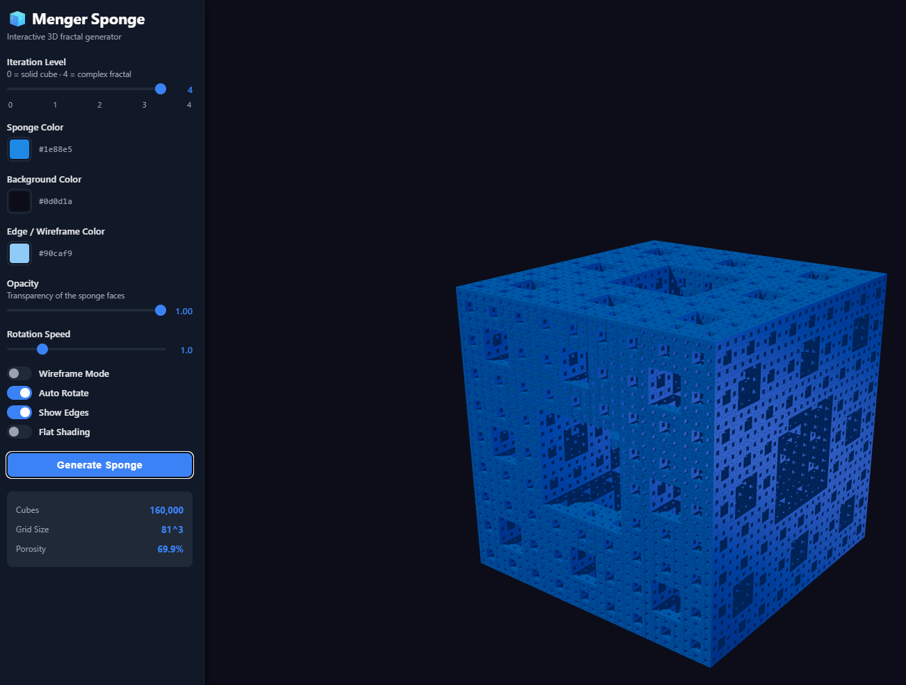

# MengerSponge

Interactive 3D Menger Sponge generator built with Vite, Three.js, and TypeScript.



## Requirements

- Node.js 20+
- npm 10+

## Getting Started

```bash
npm install
npm run dev
```

## Scripts

- `npm run dev` - Start Vite development server
- `npm run build` - Create a production build
- `npm run preview` - Preview the production build locally
- `npm run typecheck` - Run strict TypeScript checks without emitting files
